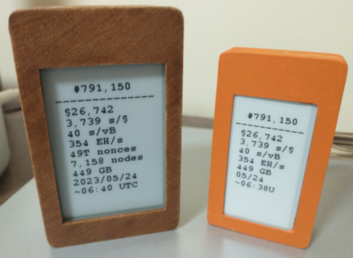

#### ₿locktime (for eink displays)
---



---
#### Setup
1. Hardware:
    - TTGO [T5s](https://www.lilygo.cc/products/t5s-2-7inch-e-paper) 2.7in/[T5](https://www.lilygo.cc/products/t5-v2-3-1) 2.13in (or any similar ESP32 based eink can work with some minor code tweaks from these)
    - Lithium-ion battery (OPTIONAL), [link](https://www.amazon.com/dp/B08T6QS58J?psc=1&ref=ppx_yo2ov_dt_b_product_details)
    - 3d printed case (OPTIONAL), [T5s](https://www.thingiverse.com/thing:4664052)/[T5](https://www.thingiverse.com/thing:4055993)(Printed at 102% scale for better accuracy, silicone glue comes handy to glue the battery and seal any loose side of the case). <br> Used Hatchbox wood filament, a wood stain and an acrylic paint after sanding.
2. IDE and libraries:
    - [Arduino IDE](https://www.arduino.cc/en/software)
    - Add these URLs under - Preferences > Additional boards manager URLs)
        ```
            https://adafruit.github.io/arduino-board-index/package_adafruit_index.json
            https://dl.espressif.com/dl/package_esp32_index.json
        ```
    - Install these libraries from Arduino IDE (Tools > Manage Libraries): Arduinojson, GxEPD2, Adafruit GFX, Adafruit BusIO
3. Connect, configure and upload:
    - Connect your device with usb and make sure to run `sudo chmod 666 /dev/ttyACM0` (replace ACM0 with your correct device location)
    - Open the correct main `.ino` file in Arduino IDE and point to correct device location
    - Rename `config_sample.cpp` to `config.cpp` and uncomment+edit to add your WiFi SSID/password and refresh frequency
    - Compile and upload, phew!
---
#### Data Source
- This code uses [blockchair](https://api.blockchair.com/bitcoin/stats) public API over https
- You can replace the API to your choice by editing the `refreshData()` and  `jsonToStr` functions (and the root cert)
- The root CA cert is in the code and valid until 2035, can be changed [here](https://github.com/ns-xvrn/blocktime-eink/blob/main/ttgo_t5s_27/ttgo_t5s_27.ino#L20)
- Stats in the screenshot(T5s 2.7in):
    - Block number, price in USD, sats per USD, tx fee, hashrate, difficulty, #nodes, full node data size, datetime in UTC

<br />

---
- ##### For TFT/LCD and command line display, check this [repo](https://github.com/ns-xvrn/blocktime).
- ##### Feedback/questions are welcome over nostr: `npub13jntyztptpq73uagw2w8hsc3hrzw58qmrvxptearjqp42xwq9kgs7jf32m`
---